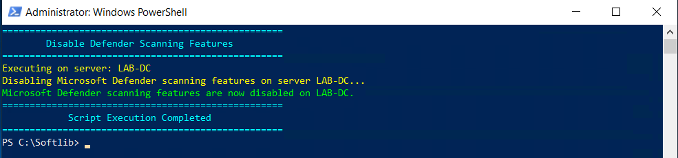

# Disable Defender Scanning Features Script

This PowerShell script disables various Microsoft Defender scanning features, including Quick Scans and Full Scan catch-ups, on the local server.

## Features

- Disables Quick Scans (both scheduled and manual).
- Disables Full Scan catch-up.
- Disables scanning of network files, mapped drives, and archive files (optional).
- Automatically detects and applies changes to the local server.

## How to Use

1. Download the script and save it as `DisableDefenderScanningLocal.ps1`.
2. Run PowerShell as an Administrator.
3. Execute the script on the target server:
   ```powershell
   .\DisableDefenderScanningLocal.ps1
   ```
The script will automatically disable the scanning features on the server it is executed on.


## License
This script is provided under the MIT License.
