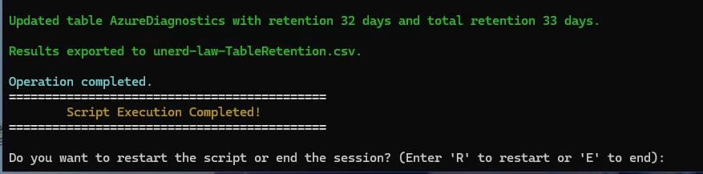
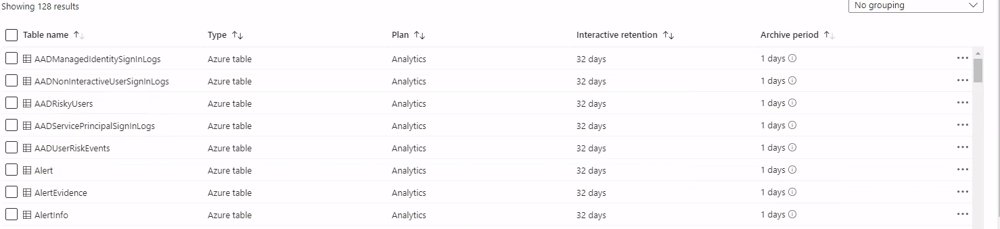

# Microsoft Azure Log Analytics Table Retention Update Script

## Overview

This script is designed to manage the retention and archive duration for tables within Microsoft Azure Log Analytics workspaces. It provides a user-friendly way to select an Azure subscription, choose a Log Analytics workspace, and set retention policies for all tables within the workspace. The results are exported to a CSV file for easy tracking.

## Features

- **Suppresses Azure subscription warnings:** Ensures a clean and readable user experience.
- **Silences output after selecting the subscription:** Focuses on the essential information and actions.
- **Exports results to a CSV file:** Keeps a record of the changes made for auditing or further analysis.
- **Returns to subscription selection after completion:** Allows for continuous use without restarting the script.

## Retention Options

1. **Retention:** Number of days data is retained for interactive queries.
   - Example: `30` (Interactive queries will be possible for the last 30 days of data)
   
2. **Total Retention:** Total number of days data is retained, including archived data.
   - Example: `730` (Data will be retained for a total of 2 years, with archived data available after the interactive retention period)

## Why This Script?

This script was created to streamline the process of managing table retention settings in Microsoft Azure Log Analytics workspaces. It aims to:
- **Simplify retention management:** Provides an intuitive interface for setting retention policies.
- **Automate repetitive tasks:** Reduces manual effort and potential errors in managing multiple tables.
- **Enhance visibility:** Ensures all changes are tracked and exported to a CSV file.

## Usage

### Prerequisites

- PowerShell 5.1 or later
- Microsoft Azure PowerShell module

### Running the Script

1. **Open PowerShell with administrative privileges.**
2. **Save the script to a `.ps1` file**, for example, `UpdateLogAnalyticsTableRetention.ps1`.
3. **Run the script** by navigating to the directory where the script is saved and executing:
   ```powershell
   .\UpdateLogAnalyticsTableRetention.ps1

## Screenshots


