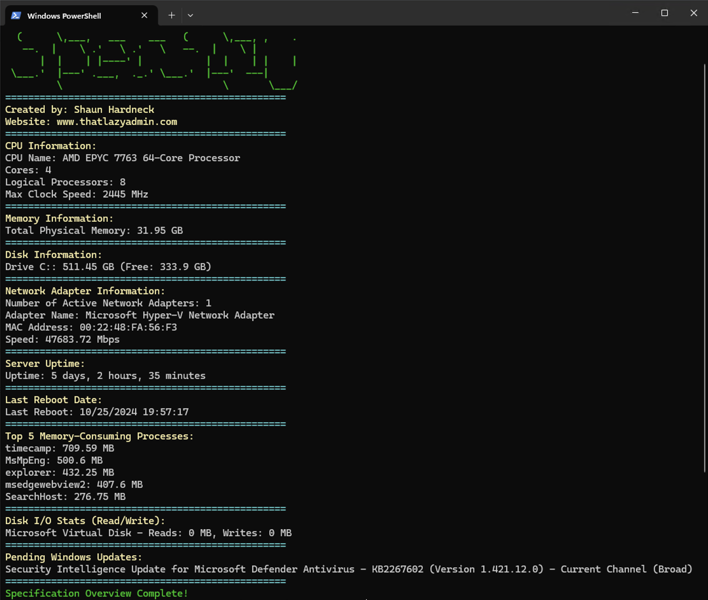

# SpecSpy - Your Instant Server Snapshot 🕵️‍♂️

**SpecSpy** is a PowerShell script that gives you a powerful, fast, and visually engaging overview of your server’s core specs—all in a single command! Say goodbye to flipping through Task Manager and hello to streamlined server insights.

## Key Benefits

- **One-Glance Server Health**: See CPU, memory, disk, and network info in seconds.
- **Stay on Top of Performance**: Quickly assess key metrics to keep your server running smoothly.
- **Professional Presentation**: Stylish ASCII art banner to start your day right!

## How to Use

1. **Run the Script**: Download and execute `.\SpecSpy.ps1` in PowerShell.
2. **Instant Results**: See color-coded outputs for each component—CPU, memory, disks, and network adapters.

## Requirements

- PowerShell 5.1+
- Administrator privileges may be required.

---

---

> Built for IT pros by [That Lazy Admin](http://www.thatlazyadmin.com) 👨‍💻
